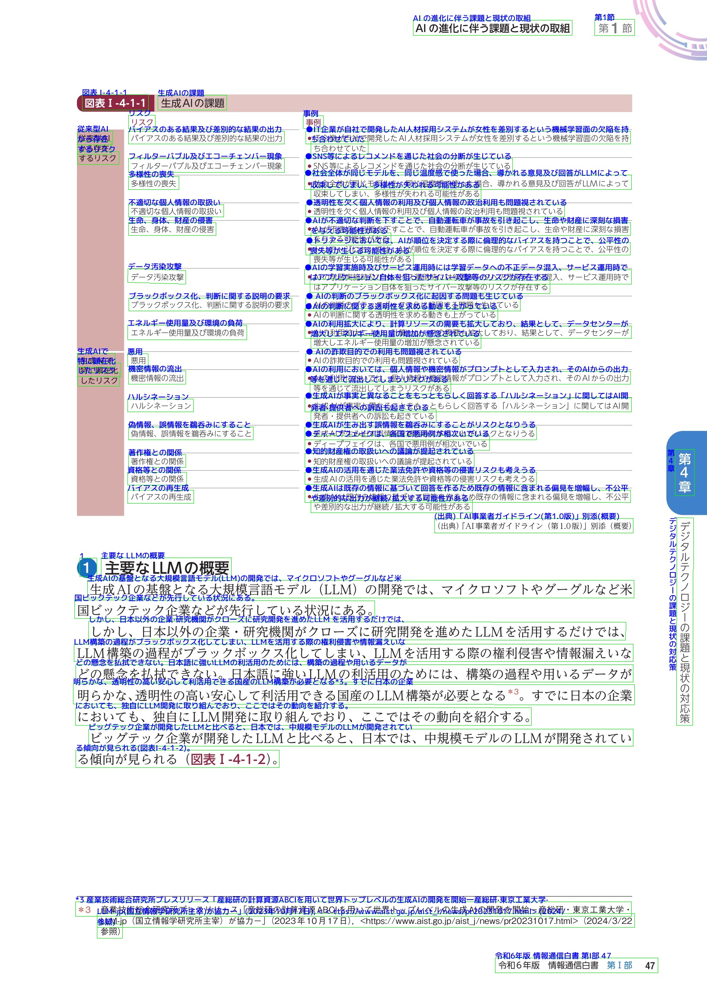
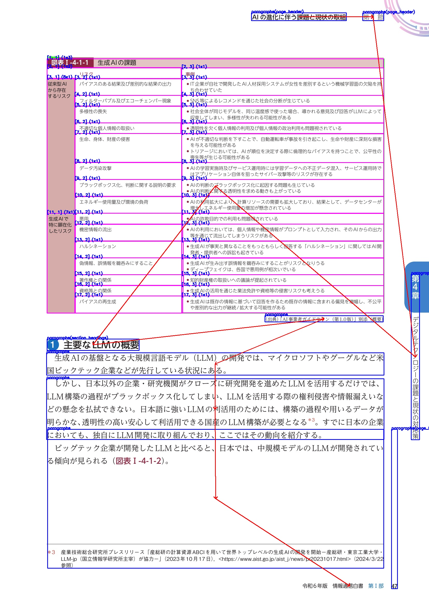

[日本語版](README.md) | English


[](https://kotaro-kinoshita.github.io/yomitoku-dev/)
[](https://pepy.tech/projects/yomitoku)

## 🌟 Introduction

YomiToku is a Document AI engine specialized in Japanese document image analysis. It provides full OCR (optical character recognition) and layout analysis capabilities, enabling the recognition, extraction, and conversion of text and diagrams from images.

- 🤖 Equipped with four AI models trained on Japanese datasets: text detection, text recognition, layout analysis, and table structure recognition. All models are independently trained and optimized for Japanese documents, delivering high-precision inference.
- 🇯🇵 Each model is specifically trained for Japanese document images, supporting the recognition of over 7,000 Japanese characters, including vertical text and other layout structures unique to Japanese documents. (It also supports English documents.)
- 📈 By leveraging layout analysis, table structure parsing, and reading order estimation, it extracts information while preserving the semantic structure of the document layout.
- 📄 Supports a variety of output formats, including HTML, Markdown, JSON, and CSV. It also allows for the extraction of diagrams and images contained within the documents.
- ⚡ Operates efficiently in GPU environments, enabling fast document transcription and analysis. It requires less than 8GB of VRAM, eliminating the need for high-end GPUs.

## 🖼️ Demo

The verification results for various types of images are also included in [gallery.md](gallery.md)

|                           Input                            |                     Results of OCR                      |
| :--------------------------------------------------------: | :-----------------------------------------------------: |
|                |  |
|                 Results of Layout Analysis                 |                 Results of HTML Export                  |
|  |       |

For the results exported in Markdown, please refer to [static/out/in_demo_p1.md](static/out/in_demo_p1.md) in the repository.

- `Red Frame`: Positions of figures and images
- `Green Frame`: Overall table region
- `Pink Frame`:` Table cell structure (text within the cells represents [row number, column number] (rowspan x colspan))
- `Blue Frame`: Paragraph and text group regions
- `Red Arrow`: Results of reading order estimation

Source of the image: Created by processing content from “Reiwa 6 Edition Information and Communications White Paper, Chapter 3, Section 2: Technologies Advancing with AI Evolution” (<https://www.soumu.go.jp/johotsusintokei/whitepaper/ja/r06/pdf/n1410000.pdf>)：(Ministry of Internal Affairs and Communications).

## 📣 Release

- **November 5, 2025 – YomiToku v0.10.1**: Added support for a **GPU-free OCR model optimized for CPU inference**.
- **April 4, 2025 – YomiToku v0.8.0**: Added support for **handwritten character recognition**.
- **November 26, 2024 – YomiToku v0.5.1 (beta)**: Public release.

## 💡 Installation

```bash
pip install yomitoku
```

- Please install the version of PyTorch that matches your CUDA version. By default, a version compatible with CUDA 12.4 or higher will be installed.
- PyTorch versions 2.5 and above are supported. As a result, CUDA version 11.8 or higher is required. If this is not feasible, please use the Dockerfile provided in the repository.

## 🚀 Usage

### Normal Mode

```bash
yomitoku ${path_data} -f md -o results -v --figure
```

### Efficient Mode

```bash
yomitoku ${path_data} -f md --lite -d cpu -o results -v --figure
```

## Command Line Arguments List

| Argument Name | Short Form | Description |
| :--- | :--- | :--- |
| `${path_data}` | - | Specify the path to a directory containing images to be analyzed or directly provide the path to an image file. If a directory is specified, images in its subdirectories will also be processed. |
| `--format` | `-f` | Specify the output file format. Supported formats are `json`, `csv`, `html`, `md`, and `pdf (searchable-pdf)`. |
| `--outdir` | `-o` | Specify the name of the output directory. If it does not exist, it will be created. |
| `--vis` | `-v` | If specified, outputs visualized images of the analysis results. |
| `--lite` | `-l` | Inference is performed using a lightweight model. This enables fast inference even on a CPU. |
| `--device` | `-d` | Specify the device for running the model. If a GPU is unavailable, inference will be executed on the CPU. (Default: `cuda`) |
| `--ignore_line_break` | - | Ignores line breaks in the image and concatenates sentences within a paragraph. (Default: respects line breaks as they appear in the image.) |
| `--figure_letter` | - | Exports characters contained within detected figures and tables to the output file. |
| `--figure` | - | Exports detected figures and images to the output file. |
| `--encoding` | - | Specifies the character encoding for the output file to be exported. If unsupported characters are included, they will be ignored. (Supported encodings: `utf-8`, `utf-8-sig`, `shift-jis`, `enc-jp`, `cp932`) |
| `--combine` | - | When a PDF is provided as input and contains multiple pages, this option combines their prediction results into a single file for export. |
| `--ignore_meta` | - | Excludes text information such as headers and footers from the output file. |

For other options, please refer to the help documentation.

```bash
yomitoku --help
```

### NOTE

- In normal mode, It is recommended to run on a GPU. The system is not optimized for inference on CPUs, which may result in significantly longer processing times.
- In efficient mode, fast inference is possible even on a CPU.
- YomiToku is optimized for document OCR and is not designed for scene OCR (e.g., text printed on non-paper surfaces like signs).
- The resolution of input images is critical for improving the accuracy of AI-OCR recognition. Low-resolution images may lead to reduced recognition accuracy. It is recommended to use images with a minimum short side resolution of 720px for inference.

## 📝 Documents

For more details, please refer to the [documentation](https://kotaro-kinoshita.github.io/yomitoku-dev/)

以下は、あなたの LICENSE セクションの **正確で自然な英訳（GitHub向け最適化版）** です。
ライセンス表記の国際標準表現と英語 OSS 文書の慣習も反映しています。

---

## **LICENSE**

The source code in this repository, as well as the model weight files hosted on HuggingFace Hub that are associated with this project, are provided under the **CC BY-NC-SA 4.0** license.
Non-commercial personal use and academic/research use are permitted freely.

**YomiToku © 2024 by Kotaro Kinoshita** is licensed under **CC BY-NC-SA 4.0**.
To view a copy of this license, please visit:
[https://creativecommons.org/licenses/by-nc-sa/4.0/](https://creativecommons.org/licenses/by-nc-sa/4.0/)

Determination of **commercial vs. non-commercial use** will follow the guideline below:

- **[Guideline for Determining Commercial / Non-Commercial Use](docs/commercial_use_guideline.en.md)**

---

## Commercial Use

For commercial use of YomiToku, we provide a **licensed product edition** through the options below.  
The commercial edition includes numerous enhancements such as improved handwriting recognition accuracy, automatic image orientation correction, and advanced layout analysis features that are **only available in the product version**.

### On-Premises / Local PC Commercial Use

For commercial use on on-premises servers or local PCs, we offer a dedicated **on-premises commercial license**.  
For inquiries, please contact us via:

- <https://www.mlism.com/>

### Cloud-Based Commercial Use (AWS Marketplace)

The commercial edition of YomiToku is also available on **AWS Marketplace**.  
All processing is executed **entirely within your own AWS environment**, with no external network communication or transmission to third-party servers.  
This makes it suitable for workloads involving confidential documents, internal corporate materials, or personal information.

- **AWS Marketplace – YomiToku-Pro Document Analyzer**  
  <https://aws.amazon.com/marketplace/search/results?searchTerms=yomitoku>
- **Usage Guide (Yom**
