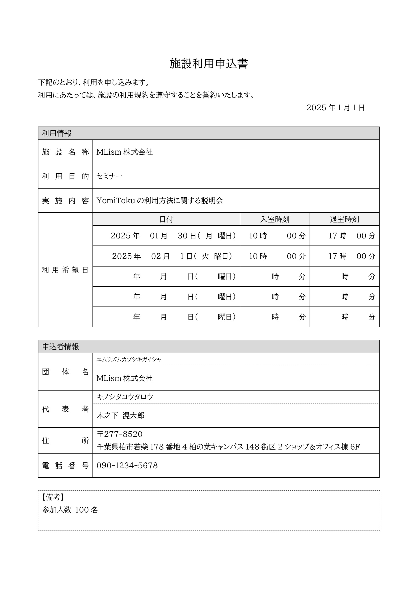
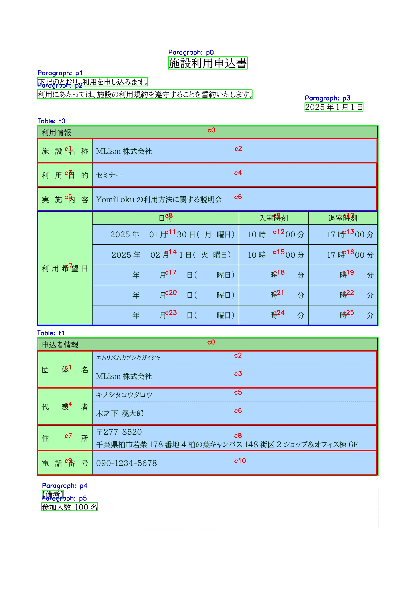

# Table Semantic Parser の利用

`TableSemanticParser` は、帳票やドキュメント画像から **「表（table）」を検出して構造化**し、さらに **セルの意味（header / cell など）** や **Key-Value（項目名→値）** といった形で意味構造を自動で推定、解析するモジュールです。

**機能概要**

* 表領域の検出
* セル分割（セル境界の推定）
* OCR（セル内テキストの読み取り）
* セル役割推定（ヘッダー／値）
* Key-Value 推定（KeyとValueの一対一の関連で表されるデータ）
* Grid構造 推定（行列で表される格子状のデータ）
* 表IDごとの検索・エクスポート（t0, t1 ...）

これらの処理を一気通貫で行います。

以下で実際に機能について、ソースコードと例を提示しながら説明します。

**区切り罫線が存在する帳票のみ**をサポートしており、区切り罫線が存在しない表はサポートしていない点についてご了承ください。

---

## サンプルデータ


## サンプルコード
<!--codeinclude-->
[demo/simple_table_semantic_analysis.py](../demo/simple_table_semantic_analysis.py)
<!--/codeinclude-->


## Table Semantic Parser の解析結果の出力
詳細はを参照してください。

- `paragraphs` : 文章内の段落やタイトルなどの文章の構成要素の情報。文字列やレイアウト内の文字列の情報を持ちます。
- `tables`: 文書内の一つの表の領域全体です。内部に`cells`や`kv_items`, `grids`といった情報を保持します。
    - `cells` : テーブル内の情報は各セル情報を保持し、セルの内部の文字列情報、`header`か`cell`かといったセルの役割の情報を保持します。
    - `kv_items`, `grids`: テーブル内の情報を意味的に構造化した情報です。詳細は後段で解説します。
- `words`: 文書内の文字列情報を保持します。文字列検出モデルで取得した情報で位置情報や領域内の文字列情報を保持します。

## 解析結果の可視化


## ２つの構造化情報の概念：kv_items と grids

Table Semantic Parser は、表を「セルの集合」として復元するだけでなく、表が持つ **意味構造** を推定して出力します。
その際に重要になる概念が **kv_items** と **grids** です。

### kv_items（Key-Value）

**kv_items** は、表の中で **ヘッダー（項目名）** と **値** が **1:1** で対応する情報を指します。

たとえば、サンプル帳票では次のような要素が `kv_items` に該当します。（可視化結果で赤枠で囲われている領域です。）

* `利用目的` → `セミナー`
* `施設名称` → `MLism株式会社`
* `実施内容` → `YomiTokuの利用方法に関する説明会`

このように、項目名と値がペアとして意味的に結びつき、**辞書（Key-Value）として扱うのが自然**なデータを `kv_items` と定義します。

### grids（格子データ）

**grids** は、表の情報が **行・列の格子（グリッド）構造** で表され、データが **行列関係** として解釈できるものを指します。（可視化結果で青枠で囲われている領域です。）

たとえば、サンプル帳票の「利用希望日」は、次のような列（例：`日付`, `入室時刻`, `退室時刻`）を持つ繰り返し行として表現でき、`grid` に該当します。

* `2025年01月30日(月曜日)` / `10時00分` / `17時00分`
* `2025年02月1日(火曜日)` / `10時00分` / `17時00分`
* ……

このように、**行がレコードが複数存在し、列が属性**として定義できる格子状のデータを `grids` と定義します。

### Cells
各テーブル内のセルは`cells`と呼ばれるスキーマに情報が保持されます。これらのにはテーブルごとに固有識別子`id`(c0など)が付与されます。
`kv_items`や`grids`はセルのidの情報が格納されており、idを参照して、セル情報の詳細情報にアクセスすることができます。また、`kv_items`や`grids`などの構造化された情報を用いる以外にも、セルの`id`を参照したり、セルの位置関係から特定のセル情報を参照するためのAPIが用意されています。


## Python API

Table Semantic Parserで解析した結果はAPIを介して、IDや文字列、Keyを検索することで、情報を取得したり、構造化情報に変換、出力することが可能です。
それぞれのAPIは書類全体の情報に対して適用する場合と指定したテーブル単位に適用するケースがあります。
わかりやすさのため、書類全体に適用する関数は`results.`をテーブル単位で適用する関数は`table.`を関数の接頭辞をドキュメントに記載しています。

特定のテーブル情報に絞って、処理を適用する場合は事前に以下の２つの関数のどちらかを用いて、テーブル情報を取得します。

テーブル情報の指定の方法はIDによる指定と位置による指定のにパターンが用意されています。テーブル情報を取得したあとセルの情報を指定したり、意味情報を利用して特定のセルの情報を抽出可能です。

---

#### results.find_table_by_id
IDによって指定した特定のテーブル情報を取得します。`table_id`はJSONや可視化画像から特定できます。ソートやIDを付与する順番は位置情報から一意の順序で割り当てているため、同じフォーマットであれば、同じIDが付与される可能性が高いです。過検知や検知ミスによってIDが変わる可能性があります。

**引数**

* `table_id : str`: 取得したいテーブルのID

**戻り値**

* `TableSemanticContentsSchema`: 特定のテーブルに対する構造化情報を保持します。

**サンプルコード**
```python
table = results.find_table_by_id("t0")
```

---

#### results.find_table_by_position

位置を指定し、その領域に重複するテーブル情報を取得します。過検知や検知ミスによって、IDで指定が安定しない場合に用いることができます。

**引数**

* `box: List[int]`：`[x1, y1, x2, y2]` 
矩形領域は左上（x1, y1）と右下（x2, y2）の2点で定義されます。x1, y1 は領域の左上の点の座標（x, y）、x2, y2 は領域の右下の点の座標（x, y）です。

**戻り値**

* `TableSemanticContentsSchema`: 特定のテーブルに対する構造化情報を保持します。


**サンプルコード**
```python
table = results.find_table_by_position([149,498,1503,1293])
```

---

## 位置情報やセルを起点に情報を取得する（ID / 位置 / 近傍）

### A. 書類全体を探索
テーブルを特定せず、書類全体のテーブルに対して、情報の取得を行います。

#### results.search_words_by_position

指定した領域内に含まれる `words` を取得し、OCR文字列を確認する。取得したい文字列が、特定の位置にあることが事前にわかっている場合にその領域の文字情報を取得したい場合などに便利です。

**引数**

* `box: List[int]`：`[x1, y1, x2, y2]` 
矩形領域は左上（x1, y1）と右下（x2, y2）の2点で定義されます。x1, y1 は領域の左上の点の座標（x, y）、x2, y2 は領域の右下の点の座標（x, y）です。

**戻り値**

* `str`：領域に含まれる文字列情報

**サンプルコード**
```python
word = results.search_words_by_position([365, 1444, 1498, 1539])
print(word)
```

**出力**

```
MLism 株式会社
```

---

### B. テーブルを指定して探索（tableオブジェクト）

#### table.find_cell_by_id

テーブル内のセルの特定の`cell_id`を持つデータを取得します。ソートやIDを付与する順番は位置情報から一意の順序で割り当てているため、同じフォーマットであれば、同じIDが付与される可能性が高いです。

過検知や検知ミスによってIDが変わる可能性があります。IDが変わってしまう場合は正しく情報を抽出できないため、セルの相対位置や意味構造を用いた抽出方法をお試しください。

**引数**

* `cell_id: str`：テーブルID（例：`"c0"`）

**戻り値**

* `CellSchema`: セルのID、文字情報、位置情報、行列番号などのセルの詳細情報を保持します。

**サンプルコード**
```python
cell = table.find_cell_by_id("c0")
print(cell.id, cell.contents, cell.box)
```

**出力**
サンプルコードはセルidとセル内の文字列、セルの位置情報を出力しています。
```
c0 利用情報 [149, 498, 1501, 550]
```

---

#### table.search_cells_by_query

テーブル内のセルの文字列情報に部分一致するセルを列挙します。

**引数**

* `query: str`: 検索したい文字列情報

**戻り値**

* `List[CellSchema]`: セル情報のリストを返却します。

**サンプルコード**
```python
cells = table.search_cells_by_query("2025")
for c in cells:
    print(c.id, c.contents, c.box)
```

**出力**
サンプルコードはセルidとセル内の文字列、セルの位置情報を出力しています。

```
c11 2025年 01月 30日(月 曜日) [365, 888, 946, 968]
c14 2025年 02月 1日(火 曜日) [365, 968, 946, 1049]
```

**ユースケース**
- 指定した文字列が含まれるセル情報を抽出したい場合
- 指定した文字列が含まれるセルの位置情報を取得したい場合

---

#### table.search_cells_right_of_key_text / below_key_text
「キー文字列を含むセル」の右（または下）にある近傍セルを取得します。

日本語の帳票の多くは特定のKeyをもち、Keyから見たときの相対的な位置に取得したい情報を持つケースがあります。
この性質を利用して、検索したいキー文字列を指定して、右や下にある近傍セルの情報を取得します。キー文字列は部分一致で判定されます。

**引数**

* `key: str`（部分一致）

**戻り値**

* `List[CellSchema]`: セル情報のリストを返却します。

**サンプルコード**
```python
# 実施内容というセルの右の近傍セルの情報を取得
vals = table.search_cells_right_of_key_text("実施内容")
for v in vals:
    print(v.id, v.contents)

# 実施内容というセルの直下にあるセルの情報を取得
vals = table.search_cells_below_key_text("実施内容")
for v in vals:
    print(v.id, v.contents)
```

**出力**

```
c6 YomiToku の利用方法に関する説明会
c7 利用希望日
```

---

## 意味構造を起点に情報を抽出する（kv_items / grids）

意味構造起点の取得方法は、**キーから値の対応（kv_items）** や **行列構造（grids）** を利用します。書類のフォーマットゆれなど軽微な変更に頑健な特性があります。構造化は自動で推定するため、解析に失敗するケースもあります。うまく取得できない場合はセルIDやセルの相対位置で取得する方法をご利用ください。

---

### A. 全体を探索（テーブル非指定）

#### results.search_kv_items_by_key

解析結果全体（複数テーブルを含む）から、キーに部分一致する `kv_items` を探索する。

**引数**

* `key: str`：検索キー（部分一致）

**戻り値**

* `List[dict]`：各要素が `{"key": [CellSchema, ...], "value": [CellSchema, ...]}`

**サンプルコード**
```python
kv_items = results.search_kv_items_by_key(key="団体名")
for kv in kv_items:
    keys = "_".join([k.contents for k in kv["key"]])
    val = kv["value"].contents
    print(keys, val)
```

**出力**
ここではKeyとValueに含まれるセルのテキスト情報を取得しています。

```
団 体 名 エムリズムカブシキガイシャ
団 体 名 MLism 株式会社
```

> 備考
> セルがネスト構造になっている場合に複数のKeyを持つ可能性があるため`key` のみ複数形のリストになっています。
> 検索したときに複数のvalueが存在する場合があるため、リストで返却されます。

---

### B. テーブルを指定して探索（tableオブジェクト）

#### table.search_kv_items_by_key

テーブル `t0` 内だけに限定して、キー部分一致のkv_itemsを探索する。

**引数**

* `key: str`

**戻り値**

* `List[dict]`：`{"key": [CellSchema], "value": [CellSchema]}` 形式

**サンプルコード**
```python
hits = table.search_kv_items_by_key(key="利用目的")
print(hits)
```

**出力**

```python
[
    {
        'key': [
            CellSchema(
                meta={},
                contents='利 用 目 的',
                role='header',
                id='c3',
                box=[149, 645, 364, 741],
                row=None,
                col=None,
                row_span=None,
                col_span=None
            )
        ], 
        'value': CellSchema(
            meta={}, 
            contents='セミナー', 
            role='cell', 
            id='c4', 
            box=[365, 645, 1498, 741], 
            row=None, 
            col=None, 
            row_span=None, 
            col_span=None
        )
    }
]
```

---

#### table.view.kv_items_to_dict

kv_items のセル参照を展開し、**辞書（key文字列 → value文字列）**として扱える形に変換します。

**戻り値**

dict[str, str]

**サンプルコード**
```python
kv = table.view.kv_items_to_dict()
print(kv)
print(kv.get("利用目的"))
```

**出力**
```
{
  "施設名称": "MLism株式会社",
  "利用目的": "セミナー",
  "実施内容": "YomiTokuの利用方法に関する説明会"
}
セミナー
```

---

#### table.view.grids_to_dict()

`grid`の構造化情報をレコード列(辞書)に変換する

**戻り値**

* `list[dict]`：`[{ "id": grid_id, "rows": [ {...}, ...]}]`

**サンプルコード**
```python
grids = table.view.grids_to_dict()
for g in grids:
    print("grid:", g["id"])
    for row in g["rows"]:
        print(row)
```

**出力**
gridの情報が辞書形式のレコードのリストとして取得されます。また、テーブル内に複数のgridが含まれる場合もあるため、それぞれ識別するためのidが付与されています。

```
grid: g0
{'日付': '2025年01月30日(月曜日)', '入室時刻': '10時00分', '退室時刻': '17時00分'}
{'日付': '2025年02月1日(火曜日)', '入室時刻': '10時00分', '退室時刻': '17時00分'}
{'日付': '年月日(曜日)', '入室時刻': '時分', '退室時刻': '時分'}
{'日付': '年月日(曜日)', '入室時刻': '時分', '退室時刻': '時分'}
{'日付': '年月日(曜日)', '入室時刻': '時分', '退室時刻': '時分'}
```

---

## 構造化データをエクスポートする（JSON / CSV）
エクスポートは、意味解析の結果をJSONやCSV形式でエクスポートし、システム間の連携を行うことが可能です。
書類全体の情報を出力する、特定のテーブル指定してエクスポートすることが可能です。

### A. 書類全体の情報を出力する

#### results.to_json
書類全体の解析結果をJSONで保存します。

**引数**

* `out_path: str`: 出力先のJSONファイルのパス

**サンプルコード**
```python
analyzer = TableSemanticParser(
    device="cuda",
    visualize=True,
)
imgs = load_pdf(path_img)
results, vis_layout, vis_ocr = analyzer(imgs[0])

# 書類の解析結果をJSONで保存する
results.to_json("out/result.json")
```

---

#### TableSemanticParserSchema.load_json
load_json は 「解析結果を保存したJSONを読み込み、TableSemanticParserSchema（= results）として復元する」ためのユーティリティです。AIによる再処理を行わずに後段の抽出処理の再実行が可能です。処理枚数のカウントはAIを呼び出した場合のみ実施されます。そのため、`load_json`で読み込んだ結果に対して、抽出処理を実行しても処理枚数のカウントは行われません。

開発、検証段階、処理時間を削減したい場合などは`to_json`で一度、保存し、再度、`load_json`で呼び出すことをおすすめします。

**引数**

* `json_path: str`: 出力先のJSONファイルのパス

**サンプルコード**
```python
from yomitoku.schemas.table_semantic_parser import TableSemanticParserSchema

json_path = "out/result.json"
results = TableSemanticParserSchema.load_json(json_path)
```

---

#### results.to_dict
`to_dict` は、書類全体に含まれる すべてのテーブルについて、
- kv_items（Key-Value 構造）
- grids（行列構造）
をテーブルID単位でまとめ、Python の dict(構造化情報) として返却するユーティリティメソッドです。
セルの位置情報などの情報を削減し、テキスト情報で構成される構造化データに変換します。

解析結果を そのままアプリケーションロジックやAPIレスポンスで扱いたい場合、書類全体の構造化情報を生成AIの入力として与えたい場合などに適しています。

**サンプルコード**
```python
from pprint import pprint
parsed = results.to_dict()
pprint(parsed)
```

**出力**
```
{
    't0': {
        'grids': [
            {
                'id': 'g0',
                'rows': [
                    {'入室時刻': '10時00分','日付': '2025年01月30日(月曜日)','退室時刻': '17時00分'},
                    {'入室時刻': '10時00分','日付': '2025年02月1日(火曜日)','退室時刻': '17時00分'},
                    {'入室時刻': '時分', '日付': '年月日(曜日)', '退室時刻': '時分'},
                    {'入室時刻': '時分', '日付': '年月日(曜日)', '退室時刻': '時分'},
                    {'入室時刻': '時分', '日付': '年月日(曜日)', '退室時刻': '時分'}]
            }
        ],
        'kv_items': {
            '利用目的': 'セミナー',
            '実施内容': 'YomiTokuの利用方法に関する説明会',
            '施設名称': 'MLism株式会社'
        }
    },
    't1': {
        'grids': [],
        'kv_items': {
            '代表者_0': 'キノシタコウタロウ',
            '代表者_1': '木之下滉大郎',
            '住所': '〒277-8520千葉県柏市若柴178番地4柏の葉キャンパス148街区2ショップ&オフィス棟6F',
            '団体名_0': 'エムリズムカブシキガイシャ',
            '団体名_1': 'MLism株式会社',
            '電話番号': '090-1234-5678'
        }
    }
}
```

---

### B. テーブル単位で情報を出力する

#### table.kv_items_to_json
テーブル内に含まれる`kv_items`を一つのJSONにまとめエクスポートします。

**引数**

* `out_path: str`

**戻り値**

* `dict`（ファイル出力に加え、メモリ上の辞書も返る実装）

**サンプルコード**
```python
table = results.find_table_by_id("t0")
kv = table.export.kv_items_to_json("out/kv_items.json")
print(kv)
```

**出力**

```
{
    "施設名称": "MLism株式会社",
    "利用目的": "セミナー",
    "実施内容": "YomiTokuの利用方法に関する説明会"
}
```

---

#### table.grids_to_json
テーブル内に含まれる`grids`を一つのjsonにまとめエクスポートします。複数の`grid`が含まれる場合があるため、リスト形式で出力されます。

**引数**

* `out_path: str`

**戻り値**

* `list[dict]`: gridをレコード列に変換した辞書データ

**サンプルコード**
```python
table = results.find_table_by_id("t0")
grids = table.export.grids_to_json("out/grids.json")
print(grids)
```

**出力**

```
[
    {
        "id": "g0",
        "rows": [
            {
                "日付": "2025年01月30日(月曜日)",
                "入室時刻": "10時00分",
                "退室時刻": "17時00分"
            },
            {
                "日付": "2025年02月1日(火曜日)",
                "入室時刻": "10時00分",
                "退室時刻": "17時00分"
            },
            {
                "日付": "年月日(曜日)",
                "入室時刻": "時分",
                "退室時刻": "時分"
            },
            {
                "日付": "年月日(曜日)",
                "入室時刻": "時分",
                "退室時刻": "時分"
            },
            {
                "日付": "年月日(曜日)",
                "入室時刻": "時分",
                "退室時刻": "時分"
            }
        ]
    }
]
```

---

#### table.grids_to_csv
テーブル内に含まれる`grids`をCSVでエクスポートとします。列名を指定することで特定の情報のみを出力可能です。

**引数**

* `out_path: str`: 出力先のCSVファイルのパス
* `columns: List[str] | None = None`: 出力したい列名。列名は部分一致で検索されます。
* `ignore_space: bool = True`: スペースを除去して出力を行うか

**戻り値**

* `List[List[str]]`（CSVの2次元配列）

以下の例では列名を指定したパターンです。列名を指定しなかった場合はgrid内のすべての情報が出力されます。

**サンプルコード**
```python
table = results.find_table_by_id("t0")
csvs = table.export.grids_to_csv("out/grid.csv", columns=["入室", "退室"])
```

**出力**

入室と退室のみを列に指定して出力

```
入室時刻,退室時刻
10時00分,17時00分
10時00分,17時00分
時分,時分
時分,時分
時分,時分
```

**生成されるファイル名**

* `out/grid_0.csv` のように grid_id が付与されます。テーブル内に複数のgridsが含まれる場合は`out/grid_1.csv`のように接尾字が変化します。
