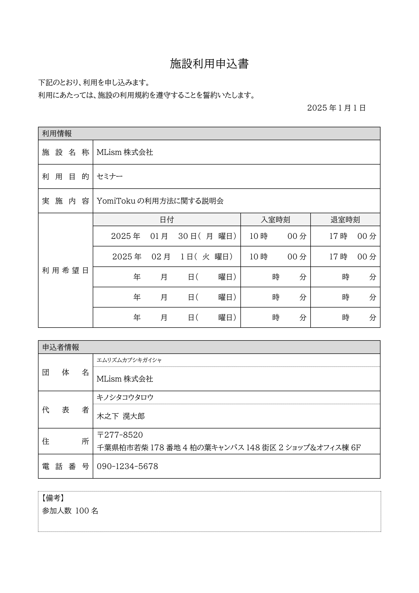
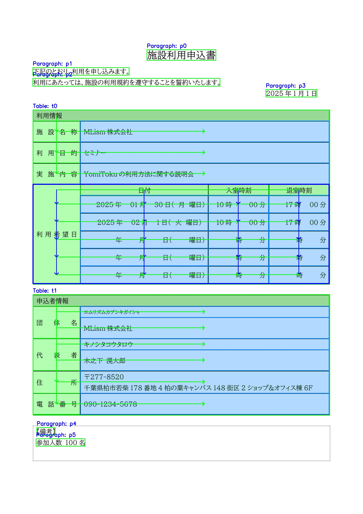
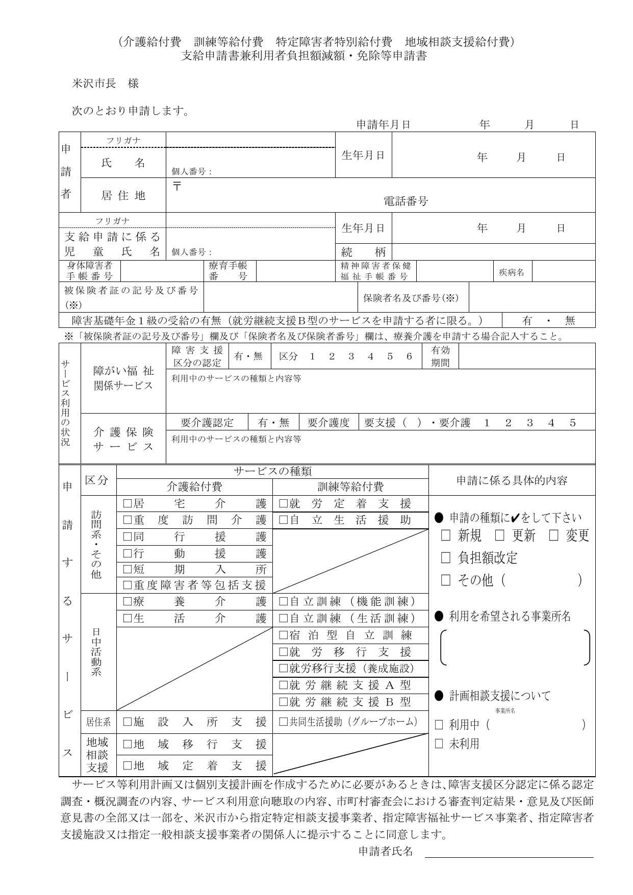
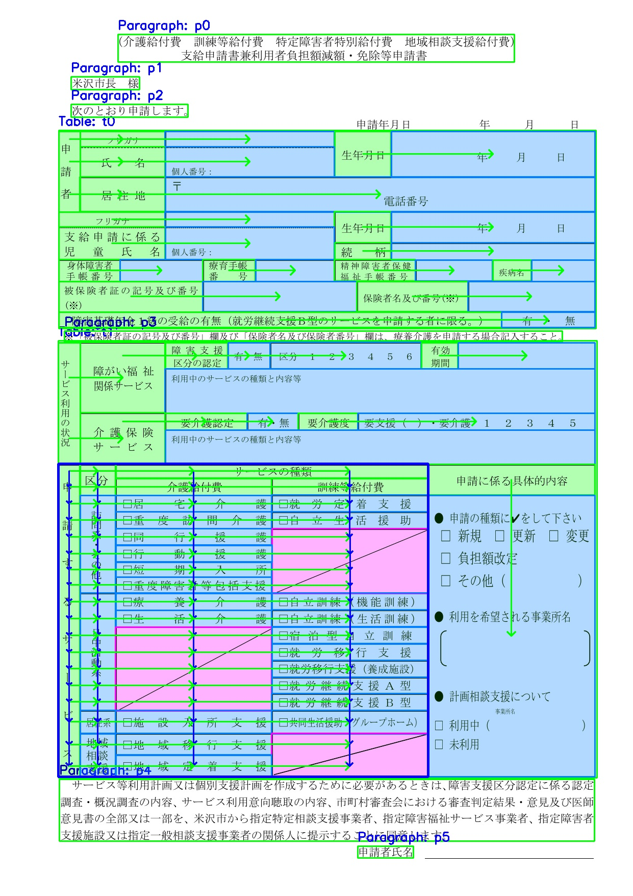
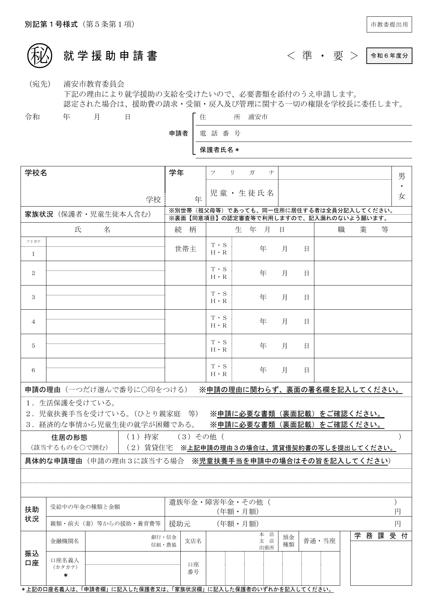
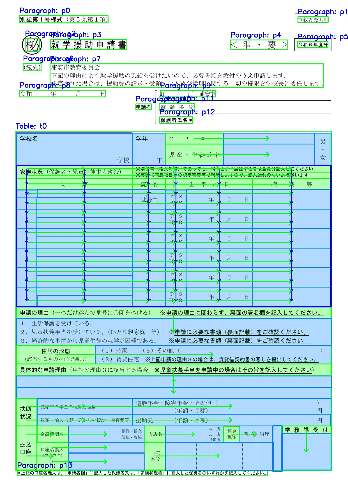
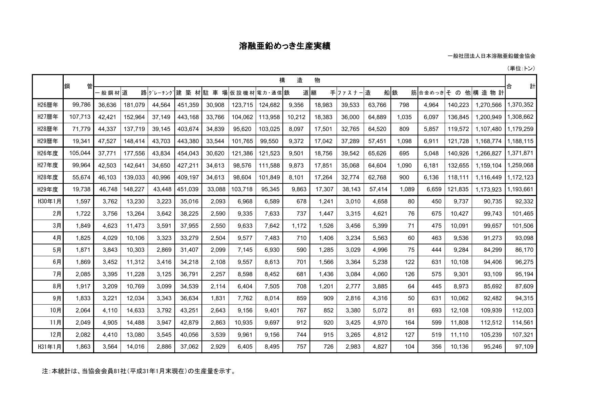
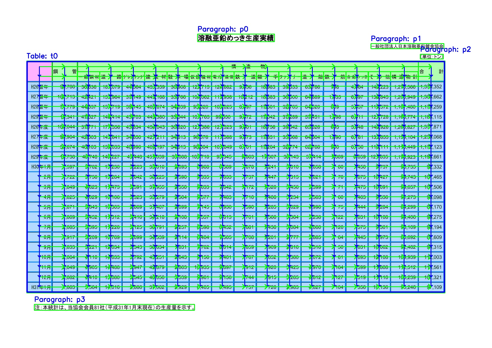

# Table Semantic Parser Gallery

`yomitoku_table` による表の意味構造解析（Key-Value・グリッド）の検証結果を掲載しています。

可視化画像の見方:

- 緑塗り = ヘッダーセル、青塗り = 値セル、マゼンタ塗り = 空セル
- 緑の矢印 = 確定した Key-Value のキー → 値のつながり
- 青枠・青矢印 = グリッド（行列データ）の領域と構造

|                          入力画像                           |                          解析結果の可視化                           |                      構造化JSON                       |                      Simple JSON                       |
| :---------------------------------------------------------: | :-----------------------------------------------------------------: | :----------------------------------------------------: | :-----------------------------------------------------: |
|   |   | [results1](static/out/tsp_gallery1_p1.json)  | [simple1](static/out/tsp_gallery1_p1_simple.json)  |
|   |   | [results2](static/out/tsp_gallery2_p1.json)  | [simple2](static/out/tsp_gallery2_p1_simple.json)  |
|   |   | [results3](static/out/tsp_gallery3_p1.json)  | [simple3](static/out/tsp_gallery3_p1_simple.json)  |
|   |   | [results4](static/out/tsp_gallery4_p1.json)  | [simple4](static/out/tsp_gallery4_p1_simple.json)  |

- 構造化JSON: Key-Value・グリッドのテキストに、由来セルのIDと座標（`key_cells` / `value_cells`）を埋め込んだデフォルト出力です。
- Simple JSON: `--simple` オプションによる、座標などのメタ情報を持たないテキストのみの出力です。

生成コマンド:

```bash
yomitoku_table ${path_data} -o results -v            # 構造化JSON + 可視化
yomitoku_table ${path_data} -o results --simple      # Simple JSON
```
